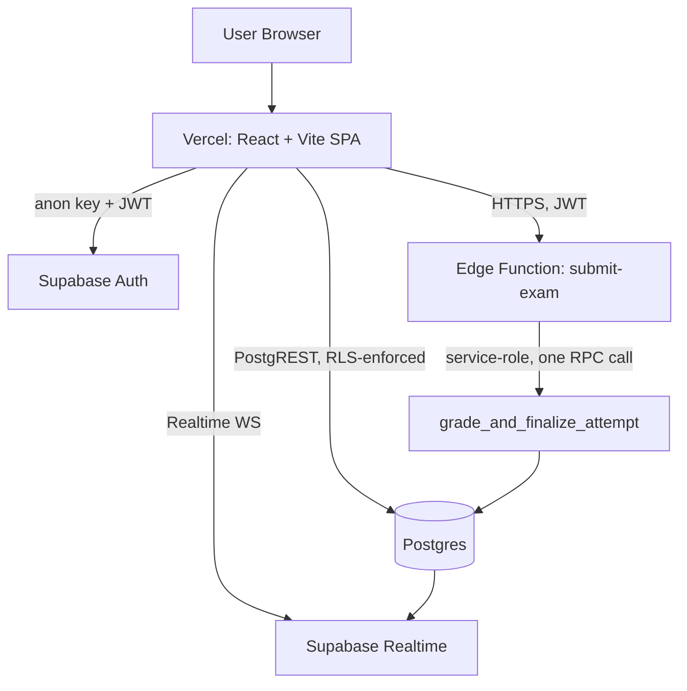

# Cloud Exam System

A production-grade, cloud-native online examination platform. Admins create and manage timed exams; students take them under a server-anchored timer with real-time integrity monitoring, and receive instantly, securely graded results.

**Live app:** https://cloud-exam-system.vercel.app

---

## Features

### Student
- Registration, login, password reset
- Browse published exams, view instructions, configurable multi-attempt support
- Real timed exam interface: question navigator, mark-for-review, autosave, offline/connection-loss indication
- Tab-switch / window-blur detection during exams (recorded for exam integrity, non-blocking)
- Automatic, server-side grading the instant an exam is submitted
- Per-question result breakdown showing correct vs. selected answers
- Personal analytics: score trend, subject-wise performance, pass rate
- In-app notifications (new exam published, result available)

### Admin
- Dashboard with live stats (students, exams, attempts, pass rate)
- Full exam lifecycle: create -> draft -> publish -> close -> reopen; edit settings at any time
- Question and MCQ-option management
- Results table and analytics charts (score distribution, pass/fail, exam-wise performance)
- Live monitoring: see active attempts and integrity flags update in real time
- Students directory with per-student stats
- Immutable audit log of key system events
- In-app notifications (new registration, exam submitted)

### Security
- Row Level Security (RLS) on every table - no table is readable/writable by default
- Correct answers are never sent to the browser before submission
- Grading happens exclusively in a single atomic Postgres function via a service-role Edge Function
- Role lives only in the database, never trusted from the client, cannot be self-escalated
- Exam timer is anchored to a server-computed deadline, immune to client clock manipulation

---

## Tech stack

| Layer | Technology |
|---|---|
| Frontend | React 18, TypeScript strict, Vite, React Router, Tailwind CSS, Recharts |
| Backend | Supabase Postgres, Auth, Realtime, Edge Functions, RLS |
| Hosting | Vercel frontend, Supabase backend |
| CI/CD | GitHub Actions -> Vercel auto-deploy on push to main |

---

## Architecture



Grading happens in one atomic Postgres function called via a single RPC round trip from the Edge Function.

### Database

Core tables: profiles, exams, questions, question_options, exam_attempts, answers, results, notifications, audit_logs, proctoring_events. See supabase/migrations/ for the full schema and RLS policies.

### Authentication

Supabase Auth handles credentials. A trigger creates a profiles row on signup, defaulting to student. Admins are never self-registrable.

### Realtime

Used for exam status changes and live monitoring. The database remains the source of truth.

---

## Local setup

```bash
git clone https://github.com/rushi-3333/cloud-exam-system.git
cd cloud-exam-system
cp .env.example .env.local
npm install
npm run dev
```

### Environment variables

| Variable | Description |
|---|---|
| VITE_SUPABASE_URL | Your Supabase project URL. Safe for the browser. |
| VITE_SUPABASE_ANON_KEY | Your Supabase anon key. Safe for the browser - RLS enforces access. |

Never put a service_role key in any VITE_* variable.

### Database setup

```bash
supabase login
supabase link --project-ref your-project-ref
supabase db push
```

### Deploy the Edge Function

```bash
supabase functions deploy submit-exam
```

### Frontend deployment

Auto-deploys to Vercel on every push to main. To deploy manually:

```bash
npm install -g vercel
vercel --prod
```

---

## Testing

```bash
npm run typecheck
npm run lint
npm run build
```

All three run automatically in GitHub Actions on every push.

---

## Screenshots

Add screenshots of the admin dashboard, exam-taking interface, and analytics pages here.

---

## Future improvements

See docs/remaining-work-checklist.md for the full list.
