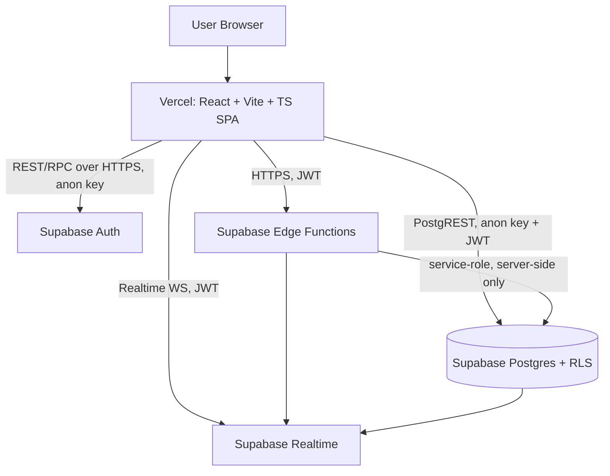
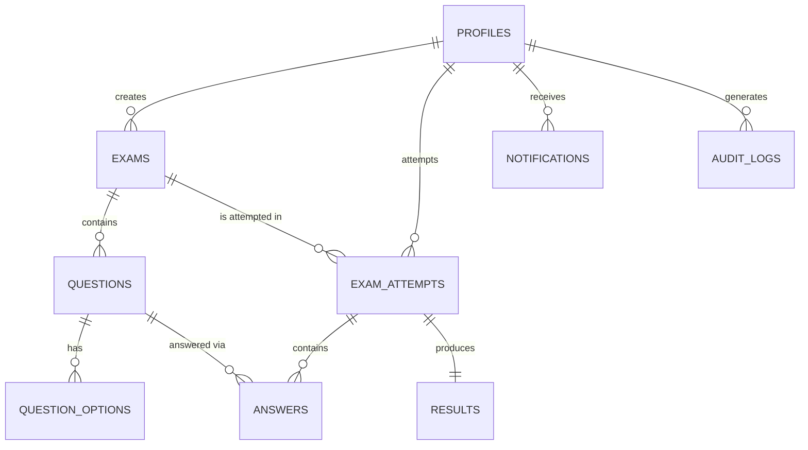
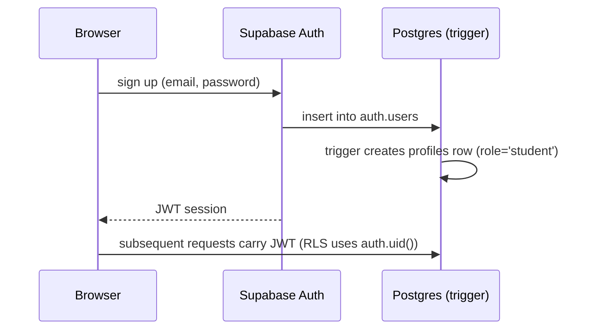
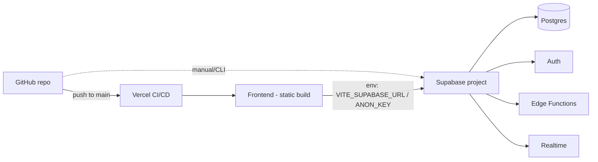

# Cloud-Based Online Examination System — Phase 1: Architecture & Plan

## 0. Directory check

`/home/claude` (my working scratch space) is empty — no existing project. I'll scaffold a fresh repo called `exam-system/` from here.

**Important limitation to flag up front:** this sandbox has no outbound network access. That means I can write 100% of the real code, SQL migrations, RLS policies, Edge Functions, and docs — but I **cannot** myself create your Supabase project, run `supabase db push`, `git push`, or `vercel deploy` against real cloud services from here. Those steps need to run on a machine (or Claude Code / your terminal) that has credentials and internet access. I'll give you exact commands at each phase, and you run them (or paste me the output/errors and I'll fix things). This is the normal division of labor for "give an AI your Supabase creds" tasks — I won't ask you to paste secret keys into this chat.

If you'd rather I *drive* the actual CLI/deploy steps myself, that's what **Claude Code** (desktop or terminal) is for — it runs on your machine with real network access, so it can run `supabase`, `git`, and `vercel` commands directly. I can build all the code here either way; just flagging the option.

---

## 1. High-level architecture

- **Frontend (Vercel):** static SPA, only ever holds the **anon key** — never the service-role key.
- **Auth:** Supabase Auth issues a JWT; a Postgres trigger creates a `profiles` row with `role='student'` by default. Role changes to `admin` can only be done via a privileged Edge Function or manually in the DB — never trusted from the client.
- **Database:** single source of truth. RLS enforced on every table. All privileged writes (score calculation, role assignment) go through Edge Functions using the service-role key, never through the browser.
- **Edge Functions:** the only place that ever sees the service-role key (stored as a Supabase secret, not in frontend env).
- **Realtime:** Postgres change feeds pushed to subscribed clients (exam status, live monitoring, notifications) — DB stays authoritative; Realtime is just a notification channel, never used to compute or trust data.

---

## 2. Database design

### Tables (Phase 4 will hold the full SQL)

| Table | Purpose | Key columns |
|---|---|---|
| `profiles` | 1:1 with `auth.users`; holds role | `id (=auth.users.id)`, `full_name`, `role ('admin'|'student')`, timestamps |
| `exams` | Exam metadata | `id`, `created_by`, `title`, `description`, `subject`, `duration_minutes`, `total_marks`, `passing_percentage`, `start_at`, `end_at`, `status ('draft'|'published'|'closed')` |
| `questions` | Belongs to an exam | `id`, `exam_id`, `question_text`, `question_type`, `marks`, `order_index` |
| `question_options` | MCQ options (separate table so other question types can reuse the pattern) | `id`, `question_id`, `option_text`, `is_correct`, `order_index` |
| `exam_attempts` | One row per student attempt | `id`, `exam_id`, `student_id`, `started_at`, `server_deadline_at`, `status ('in_progress'|'submitted'|'auto_submitted'|'expired')`, `submitted_at` |
| `answers` | Student's selected option(s) per question per attempt | `id`, `attempt_id`, `question_id`, `selected_option_id`, `marked_for_review`, `updated_at` |
| `results` | Computed outcome of an attempt (written only by Edge Function via service role) | `id`, `attempt_id` (unique), `marks_obtained`, `total_marks`, `percentage`, `correct_count`, `wrong_count`, `unanswered_count`, `pass_status` |
| `notifications` | Per-user notification feed | `id`, `user_id`, `type`, `title`, `body`, `read_at` |
| `audit_logs` | Immutable event trail | `id`, `user_id`, `action`, `entity`, `entity_id`, `metadata (jsonb)`, `created_at` |

### ER diagram

**Key design choices:**
- `question_options` as its own table (not a JSON array on `questions`) so the DB design supports future question types (true/false, multi-select, short-answer) without a schema rewrite.
- `answers.selected_option_id` is nullable (unanswered) and updatable only while `exam_attempts.status = 'in_progress'` and only by the owning student — enforced by RLS.
- `results` has **no** RLS insert/update policy for students at all — only the `submit-exam`/`calculate-result` Edge Function (service role) can write it. Students get a read-only policy scoped to their own `attempt_id`.
- `server_deadline_at` (computed as `started_at + duration_minutes` at attempt-creation time, on the server) is what the timer counts down to — never trusts the browser clock.

---

## 3. Authentication flow

Admin accounts are **not** self-registrable from the public UI. First admin is created via a one-time seed script (Phase 6) that signs up a user then flips their `profiles.role` to `admin` directly in the DB — after that, admins can only be promoted by an existing admin through a protected Edge Function.

---

## 4. Realtime architecture

Realtime subscribes to Postgres change feeds — it never bypasses RLS. Planned channels:

| Feature | Table watched | Who subscribes |
|---|---|---|
| Exam list updates | `exams` (status changes) | students on `/student/exams` |
| Live monitoring | `exam_attempts` | admins on `/admin/live-monitoring` |
| Notifications | `notifications` (filtered `user_id=eq.<self>`) | logged-in user |
| Dashboard stats | `exam_attempts`, `results` | admin dashboard (debounced re-fetch, not a raw stream) |

Realtime is explicitly **not** used for the timer (timer is computed from `server_deadline_at` vs. `now()`, refreshed on poll/interval) or for score computation.

---

## 5. Edge Functions (server-side authority)

| Function | Responsibility |
|---|---|
| `start-exam` | Validates exam is published & within window, creates `exam_attempts` row with server-computed `server_deadline_at`, prevents duplicate in-progress attempts |
| `submit-exam` | Validates ownership + timing, marks attempt submitted, triggers evaluation, is idempotent (prevents double submission) |
| `calculate-result` | Called by `submit-exam`; joins `answers` vs `question_options.is_correct`, computes marks/percentage/pass-fail, writes `results` |
| `create-exam` / `publish-exam` | Admin-only (checked via `profiles.role`), writes audit log |
| `get-analytics` | Aggregates results server-side (avoids shipping raw data + heavy client joins) |
| `send-notification` | Inserts notification rows on key events |

All functions verify the caller's JWT and re-check `profiles.role` server-side — the client's claimed role is never trusted.

---

## 6. Deployment architecture

GitHub Actions will run `tsc --noEmit`, `eslint`, `vitest`, and `vite build` on every push before Vercel deploys.

---

## 7. Key security risks identified & mitigations

| Risk | Mitigation |
|---|---|
| Client fakes `role=admin` | Role lives only in `profiles` table, read via RLS with `auth.uid()`; every admin RLS policy/Edge Function re-checks it server-side |
| Client manipulates local clock to get more exam time | Countdown computed from `server_deadline_at` (server timestamp), not `Date.now()` alone; `submit-exam` re-validates against DB timestamp |
| Student reads correct answers before submitting | `question_options.is_correct` excluded from any student-facing `select` (RLS column-level via view, or a public-safe RPC that strips the field) |
| Double submission / race condition | `exam_attempts.status` transition guarded by a unique constraint + `WHERE status='in_progress'` update, function is idempotent |
| Service-role key leaking to browser | Only ever referenced inside Edge Functions / Supabase secrets, never in `VITE_*` env vars |
| Student modifies own score | `results` table has no client-writable RLS policy at all |
| Cross-student data leakage | Every student-scoped table's RLS policy filters `student_id = auth.uid()` / joins through `exam_attempts.student_id` |

---

## 8. TODO checklist (living document, updated every phase)

- [x] Phase 1 — Architecture, DB design, security review (this doc)
- [ ] Phase 2 — Scaffold Vite+React+TS project, Tailwind, folder structure
- [ ] Phase 3 — Supabase project config, client setup, env vars
- [ ] Phase 4 — SQL migrations (all tables, indexes, constraints)
- [ ] Phase 5 — RLS policies (with inline explanations)
- [ ] Phase 6 — Auth (signup/login/logout/reset/admin seed) + protected routes
- [ ] Phase 7 — Layouts & routing (public/student/admin)
- [ ] Phase 8 — Admin module (exam/question CRUD, publish/close)
- [ ] Phase 9 — Student module (dashboard, exam list, results, analytics)
- [ ] Phase 10 — Exam-taking interface (navigator, timer, mark-for-review)
- [ ] Phase 11 — Realtime wiring
- [ ] Phase 12 — Edge Functions
- [ ] Phase 13 — Auto-evaluation & result pipeline
- [ ] Phase 14 — Analytics + charts
- [ ] Phase 15 — Notifications + audit logs
- [ ] Phase 16 — Tests
- [ ] Phase 17 — Security review
- [ ] Phase 18 — Performance pass
- [ ] Phase 19 — GitHub prep (README, CI)
- [ ] Phase 20 — Production deployment walkthrough
